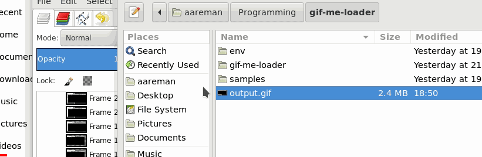

# gif-me-loader
A simple utility for adding progressbars to GIF images.

# Installation

### With pip3

`pip3 install gifmeloader`

### Manually (with pip3 ;) )

```
$ git clone https://github.com/aareman/gif-me-loader.git
$ cd gif-me-loader
$ pip3 install .
```

# Example

```
$ gifmeloader -s samples/test1.gif -o output.gif -c 255 0 0 1 -d 50 -l 0

```

Before: 


After:



